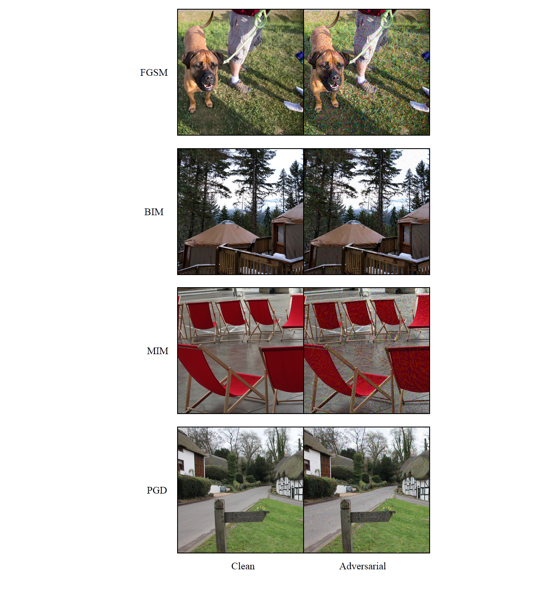

# generate-adv-examples
This repository is a PyTorch Implementation of generating adversarial images using various types of attacks schemes.



## Clone the repository
Clone this repository into any place you want.
```bash
git clone https://github.com/aamir-mustafa/generate-adv-examples
cd generate-adv-examples
```

Download the  NIPS 2017 Adversarial Learning Development Dataset comprising of 1000 ImageNet alike images of size 299 x 299.
[Kaggle Link](https://www.kaggle.com/google-brain/nips-2017-adversarial-learning-development-set).
Download the file ``images.zip`` to the directory.


## Generate and Save Adversarial Examples 

Use the following python file to generate and save the adversarial examples against various ImageNet pre-trained models. We provide implementations for four types of attacks : FGSM, BIM, MIM, PGD

``generate.py`` 

